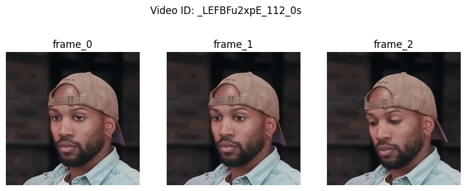

# Download, process and extract frames from videos in CelebV-HQ Dataset

## Description

- This repository contains scripts for downloading and processing videos from the [High-Quality Celeberity Video Dataset (CelebV-HQ)](https://celebv-hq.github.io/). The scripts, which are mainly inherited from [CelebV-HQ](https://github.com/CelebV-HQ/CelebV-HQ) repository, were modified to run on multi processes to expedite processing.
- Once the processed videos are loaded, you can extract a specified number of frames from each video at a predetermined resolution. The temporal stride, which is the time interval between consecutive frames, is also configurable. The output frames are saved in PNG format.
- The extracted frames are used as training and validation dataset for the task of multi-frame super resolution as described in the [Multi-frame Super Resolution via Iterative Refinement ](https://github.com/felixlephuoc/Multiframe-Super-Resolution-via-Iterative-Refinement.git)repository. You can divide the set of extract frames to train and validation set using a selected split ratio.

## Installation

Install ffmpeg package

```bash
sudo apt install pkg-config
sudo apt install ffmpeg libavformat-dev libavcodec-dev libswscale-dev 
```

Prepare the environment

```bash
pip install yt-dlp
pip install opencv-python
```

## Usage

#### Download and Process CelebV-HQ videos

```bash
python download_and_process.py --processed_video_root "/path/to/processed/videos"
```

#### Extract frames from videos

```bash
# specify your desired number of frames, time interval (in seconds) and target resolution
python3 extract_frames.py -i "path/to/processed/videos" --n_frames 3 --interval 0.5 --size 512 

```

Extracted frames are stored under `celebvhq_frames` as follows:

```
celebvhq_frames/
        ├── celebvhq_3_frames_0.5_second_interval_512
        │   ├── __f2KtcXAxI_1_frames
        │   │   ├── frames_0.png
        │   │   ├── frames_1.png
        │   │   └── frames_2.png
        │   |── __lRwnjxeCg_1_frames
        │   |    ├── frames_0.png
        │   |    ├── frames_1.png
        │   |    └── frames_2.png
        |   |
        |   |___ ...
        |
        └── celebvhq_5_frames_0.3_second_interval_512
            ├── 0H8HRSl_90Y_0_frames
            │   ├── frames_0.png
            │   ├── frames_1.png
            │   ├── frames_2.png
            │   ├── frames_3.png
            │   └── frames_4.png
            |── _0tf2n3rlJU_0_frames
            |   ├── frames_0.png
            |   ├── frames_1.png
            |   ├── frames_2.png
            |   ├── frames_3.png
            |   └── frames_4.png
            |
            |___ ...
```

#### Split the set of frames to train and validation

```bash
# choose your split ratio
python3 split_dataset.py -d "/path/to/extracted/frames" -r 0.9
```

## Sample output frames

#### 3 frame per video with time interval = 0.5 second:




#### 5 frames per video with time interval = 0.3 second


